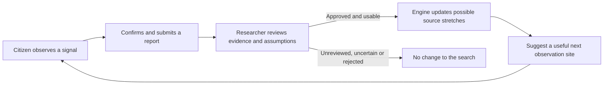
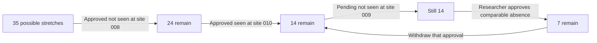
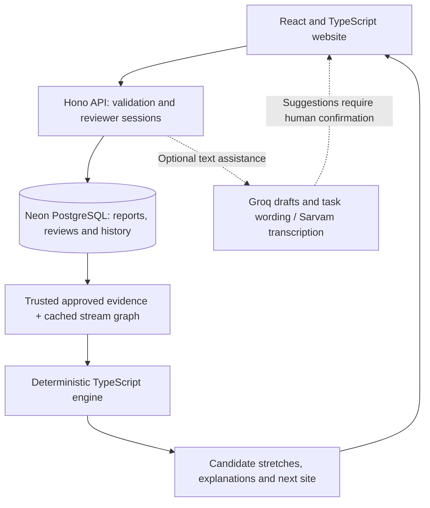

# StreamTrace

### Turn a stream observation into a useful next check.

Built for the **OneAquaHealth IEEE Global Hackathon**, StreamTrace connects citizen observations with researcher review and an explainable stream-network engine. It answers one practical question: **“Where should we check next?”**

Someone notices foam in a stream. That tells us where the foam was seen, but the source could be farther upstream. StreamTrace helps researchers turn scattered observations into a smaller, traceable search and choose the next observation that could separate the remaining possibilities.

[Impact](#why-this-matters) · [How it works](#how-it-works) · [Evidence](#what-we-can-demonstrate) · [Try it](#try-it-locally) · [Technical reference](docs/technical-reference.md)

Inspect the [simulated prototype FHIR bundle](docs/fhir/sample-bundle.json) and its [export and validation instructions](docs/fhir/README.md). Reviewers can download a bundle from the case panel next to the JSON export.

## Why this matters

Field time is limited. Checking every stretch in order can spend that time on sites that tell an investigation very little. Community reports are useful, but a report needs context and review before it can guide a search.

StreamTrace brings those pieces together:

| Who benefits | What StreamTrace provides | Why it matters |
| --- | --- | --- |
| Citizens | A guided report without an account, a confirmation step and a status reference | Makes local observations available to researchers through a clear submission process |
| Researchers | A review queue, reversible decisions and explanations for excluded stretches | Keeps the search tied to evidence they can inspect and correct |
| Field teams | A next site chosen to separate remaining candidate stretches | Helps direct limited observation effort toward a useful check |
| Communities and ecosystems | A path from local noticing to a structured investigation | Could support earlier follow-up on freshwater concerns, subject to field validation |

This is the **One Health** connection: freshwater concerns matter to people, aquatic life and the surrounding environment. Our contribution is the investigation step between noticing a concern and planning follow-up. Reduced exposure, restored biodiversity and faster real-world response are intended downstream benefits, **not measured outcomes of this prototype**.

## How it works



1. **Observe.** Report the case signal: foam, colour, litter, dead fish or discharge. Choose a site and record “seen”, “not seen” or “cannot tell”. Other concerns go to a general inbox.
2. **Confirm.** Check the report before submitting. Optional AI can help draft text; it cannot approve evidence.
3. **Review.** A researcher checks the observation and the case assumptions. A not-seen report needs an explicit comparability check before it can exclude anything.
4. **Narrow and repeat.** The engine recalculates possible source stretches and recommends an informative site. Withdrawing an approval recalculates the result; conflicting evidence pauses recommendations.

### A concrete example

The bundled Coimbra demo starts with **35 candidate stream stretches**. These observations are simulated:



Seeing a signal keeps possible sources upstream of the observation site, including its own stretch. A comparable not-seen observation excludes that upstream set. Pending reports have no effect.

A **reach** is one stream stretch in the model. Seven candidates means seven stretches still fit the evidence, not seven equally likely sources, a measured distance, or a confirmed pollution source.

### Why this next site?

The engine compares what would remain if a signal were seen or not seen at each eligible site. It chooses the site whose larger possible result is smallest, so either answer could be useful. This is **balanced bisection**.

For the initial 35-stretch Coimbra graph, site **009** splits the candidates into **18 / 17**. Site **011**, at the outlet, splits them into **35 / 0**, which cannot separate the candidates. The recommendation is about learning from the next observation. It is not a contamination probability or a guarantee of halving the search every time.

## What we can demonstrate

The [reproducible benchmark](benchmarks/RESULTS.md) compares bisection with random and ascending-site checks on three **synthetic** networks. These are mean checks to reach a single candidate in the clean-observation scenario:

| Synthetic network | StreamTrace bisection | Random checks | Ascending-site checks |
| --- | ---: | ---: | ---: |
| Chain, 24 reaches | 4.67 | 16.48 | 12.46 |
| Balanced, 30 reaches | 5.07 | 19.10 | 19.97 |
| Uneven, 24 reaches | 4.71 | 16.02 | 14.46 |

Fixed seed `20261003`; every origin is tested, with 50 random trials per origin. Under these idealised conditions, bisection uses fewer checks than either baseline. **These results do not measure field travel time, water quality or health outcomes.**

The same benchmark also tests missing and erroneous observations. Missing checks can leave a case unresolved. Flipping the first answer gives bisection a wrong single candidate in every tested origin, without a conflict. This is why researcher review and model assumptions matter: a precise-looking result can still be wrong.

A field pilot should measure checks and travel time against a baseline, report-to-review time, unresolved/conflicting cases, and agreement with independent investigation or sampling. Environmental and health benefits need separate outcome evidence.

## Inside the prototype



- **Evidence stays human-reviewed.** Signed reviewer sessions and database row-level security control access. The engine uses trusted review records, not client-supplied approvals or AI confidence.
- **The map is reproducible.** The cached OpenStreetMap study graph covers a bounded Rio Mondego section near Coimbra, Portugal: 35 reaches and 11 prototype sites. Connections use shared OSM nodes; geometric crossings do not create connections. Data attribution: OpenStreetMap contributors, ODbL.
- **AI assists with communication.** Optional drafting and task wording use guarded outputs and deterministic fallbacks. Voice transcription is optional. The engine works independently of AI.
- **Results can be inspected.** Map, connection diagram and text list show the same investigation. Reviewer exports include JSON and a base FHIR R4 Bundle; no clinical profile certification is claimed.

The model assumes one persistent origin region, normal downstream propagation and comparable observations. Flow direction was checked visually for the prototype, not by hydrology experts. Site access is assumed for demonstration and has not been verified in the field. The bounded graph does not cover every possible upstream source.

**StreamTrace supports investigation planning; it does not identify chemicals or certify water safety.** Stay on safe public paths, do not enter the water, and skip unsafe observations.

## Try it locally

Use **Node 22.18+** for the TypeScript backend and scripts.

```sh
npm ci
npm run dev
```

Open the URL printed by Vite, normally `http://localhost:5173`.

| Page | What to try |
| --- | --- |
| `/docs` | Read the impact, workflow, worked example and system guide |
| `/play` | Follow the guided simulated investigation; optional wording assistance may contact the API |
| `/demo` | Explore the browser-only reviewer demo, approve the pending report, withdraw it and load a conflict; no API or map-tile requests |
| `/workflow` | Open the live citizen or researcher portal |
| `/report?mode=live` | Submit a real observation when the backend is configured |
| `/login` | Sign in as an allowlisted reviewer and open the live queue |

The demo needs no database, account or provider key. Simulated reports never enter the live queue. Live errors offer retry or an explicit simulation choice.

### Connect the live system

Copy `.env.example` to the ignored `.env`. Configure a Neon PostgreSQL database, separate owner and restricted runtime credentials, `APP_LOGIN_PASSWORD`, `JWT_SECRET`, the frontend `CORS_ORIGIN` and reviewer email/password arrays. Remove unused optional placeholders. Local defaults are API port `3000` and frontend origin `http://localhost:5173`. Keep credentials server-side.

On your intended development database, run:

```sh
npm run migrate
npm run check:runtime
npm run setup:citizen -- --confirm
npm run seed:reviewers -- --confirm
npm run api
# In another terminal:
npm run dev
```

Setup creates the cached sites and five signal cases, not observations or approvals. See the [technical reference](docs/technical-reference.md) for environment variables, API contracts, deployment, privacy, data provenance and AI limits.

## Verify and explore

```sh
npm run typecheck
npm test
npm run build
npm run benchmark
```

The benchmark regenerates its result files. Database integration and RLS tests require a separate disposable `TEST_DATABASE_URL`; integration coverage is skipped when it is absent. Keep test databases separate from live data. Provider, browser and field checks are distinct from automated tests.

| Reference | Contents |
| --- | --- |
| [Technical reference](docs/technical-reference.md) | Engine rules, setup, API, authorization, map provenance and AI contracts |
| [Benchmark results](benchmarks/RESULTS.md) | Clean, missing and erroneous observations with reproducible methodology |
| [AI evaluation](ai_eval_results.md) | Small development-set results with provider/fallback boundaries |
| [Adversarial review](ADVERSARIAL_REVIEW.md) | Model risks and interpretation limits |
